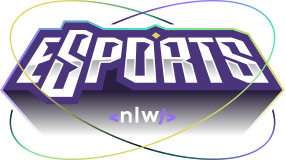

[![Contributors][contributors-shield]][contributors-url]
[![Forks][forks-shield]][forks-url]
[![Stargazers][stars-shield]][stars-url]
[![Issues][issues-shield]][issues-url]
[![MIT License][license-shield]][license-url]

<!-- PROJECT LOGO -->
<br />
<samp>
<p align="center">
  <a href="#">
    
  </a>

  <h3 align="center">NLW eSports</h3>

  <p align="center">
    Find your duo
    <br />
    <a href="#"><strong>Demo</strong></a>
    &#124;
    <a href="https://www.figma.com/file/SOKqRWoHHTlHBTbtsq4SeB/NLW-eSports-(Community)?node-id=0%3A1"><strong>Figma</strong></a>
    &#124;
    <a href="https://github.com/SilasRodrigues19/nlw-esports-frontend"><strong>Frontend</strong></a>
    <br />
  </p>
</p>

<!-- TABLE OF CONTENTS -->
<details open="open">
  <summary>Table of Contents</summary>
  <ol>
    <li>
      <a href="#about-the-project">About The Project</a>
      <ul>
        <li><a href="#built-with">Built With</a></li>
      </ul>
    </li>
    <li><a href="#contributing">Contributing</a></li>
    <li><a href="#license">License</a></li>
    <li><a href="#contact">Contact</a></li>
  </ol>
</details>

<!-- ABOUT THE PROJECT -->

## About The Project

<hr>

### List all games

[![Preview][product-screenshot]](#)

### List ads by game

[![Preview][product-screenshot2]](#)

### Create Ads

[![Preview][product-screenshot3]](#)

### Games collection

[![Preview][product-screenshot4]](#)

### Ads collection

[![Preview][product-screenshot5]](#)

### Built With

Technologies used in the project.

### Tools

- [Prisma](https://www.prisma.io/)
- [@prisma/client](https://www.npmjs.com/package/@prisma/client)

### Frameworks / Libraries

- [Express](https://expressjs.com/pt-br/)

### Languages

- [TypeScript](https://www.typescriptlang.org/)

<!-- GETTING STARTED -->

### Getting Started

1. Clone the repo

```sh
  git clone https://github.com/SilasRodrigues19/nlw-esports-backend.git && cd nlw-esports-backend
```

2. Install NPM packages

```sh
  npm install
```

3. Run the project

```sh
  npm run dev
```

4. Run Prisma Studio

```sh
  npx prisma studio
```

<!-- CONTRIBUTING -->

## Contributing

Contributions are what make the open source community such an amazing place to learn, inspire, and create. Any contributions you make are **greatly appreciated**.

1. Fork the Project
2. Create your Feature Branch (`git checkout -b feature/AmazingFeature`)
3. Commit your Changes (`git commit -m 'Add some AmazingFeature'`)
4. Push to the Branch (`git push origin feature/AmazingFeature`)
5. Open a Pull Request

<!-- LICENSE -->

## License

Distributed under the MIT License. See `LICENSE` for more information.

<!-- CONTACT -->

## Contact

Silas Rodrigues - [@jinuye1](https://twitter.com/jinuye1) - silasrodrigues.fatec@gmail.com

Project Link: [https://github.com/SilasRodrigues19/nlw-esports-backend](https://github.com/SilasRodrigues19/nlw-esports-backend) <br>

<!-- MARKDOWN LINKS & IMAGES -->
<!-- https://www.markdownguide.org/basic-syntax/#reference-style-links -->

[contributors-shield]: https://img.shields.io/github/contributors/SilasRodrigues19/nlw-esports-backend.svg?style=for-the-badge
[contributors-url]: https://github.com/SilasRodrigues19/nlw-esports-backend/graphs/contributors
[forks-shield]: https://img.shields.io/github/forks/SilasRodrigues19/nlw-esports-backend.svg?style=for-the-badge
[forks-url]: https://github.com/SilasRodrigues19/nlw-esports-backend/network/members
[stars-shield]: https://img.shields.io/github/stars/SilasRodrigues19/nlw-esports-backend.svg?style=for-the-badge
[stars-url]: https://github.com/SilasRodrigues19/nlw-esports-backend/stargazers
[issues-shield]: https://img.shields.io/github/issues/SilasRodrigues19/nlw-esports-backend.svg?style=for-the-badge
[issues-url]: https://github.com/SilasRodrigues19/nlw-esports-backend/issues
[license-shield]: https://img.shields.io/github/license/SilasRodrigues19/nlw-esports-backend.svg?style=for-the-badge
[license-url]: https://github.com/SilasRodrigues19/nlw-esports-backend/blob/master/LICENSE
[product-screenshot]: ./public/preview.png
[product-screenshot2]: ./public/preview2.png
[product-screenshot3]: ./public/preview3.png
[product-screenshot4]: ./public/preview4.png
[product-screenshot5]: ./public/preview5.png
[license-url]: https://github.com/SilasRodrigues19/nlw-esports-backend/blob/master/LICENSE

<br><hr>
[🔼 Back to top](#NLW-eSports)
